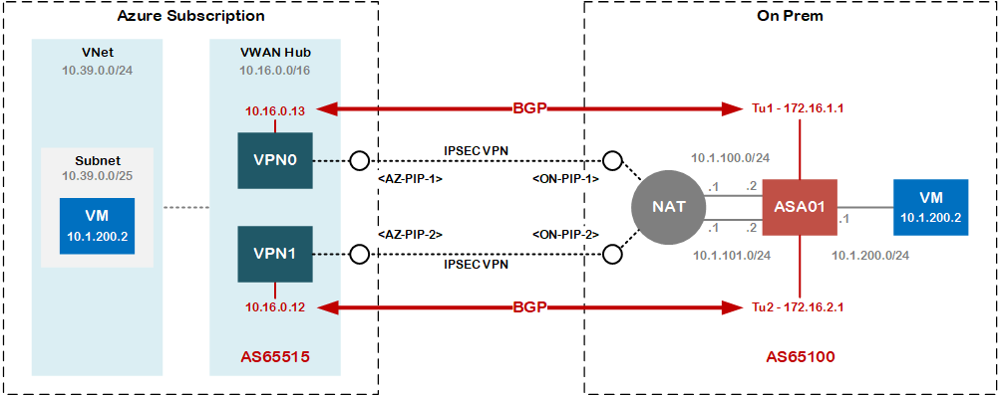

# Cisco ASA Configuration - Connecting Resilient VPN to Azure VWAN Hub

This is largely based on [this](https://github.com/jwrightazure/lab/tree/master/asa-vpn-to-active-active-azurevpngw-ikev2-bgp) excellent article by Jeremey Wright. In order to better understand the design decisions and constraints that may steer you to towards this approach, I collaborated on a deep-dive session with Adam Stuart on the subject, where we delved into the options (and caveats!) around using Cisco ASAs to connect to Azure VWAN. Adam has written up output of that [here](https://github.com/adstuart/azure-vwan-asa).

This repo provides a sanitised version of the working ASA configuration, with a few extra notes

## Lab Topology

## Configuration and Notes

Config file in the repo.
